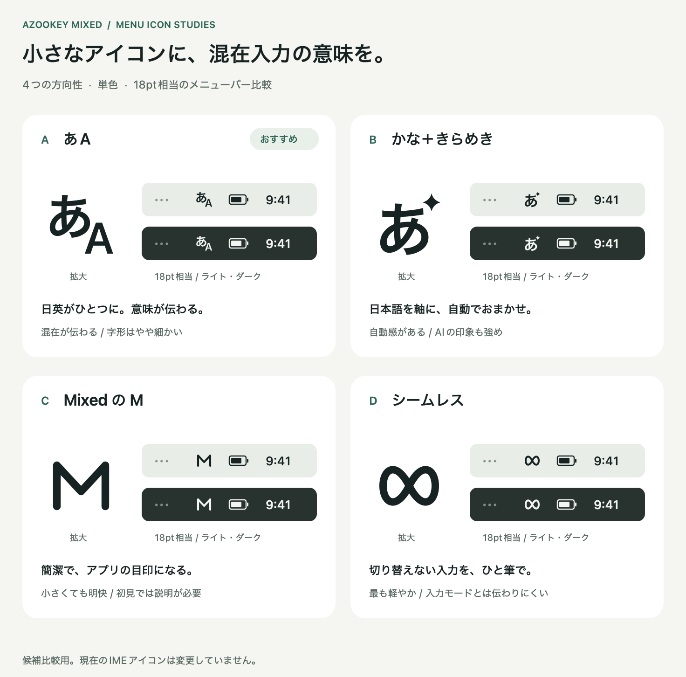

# Mixed入力メニューのアイコン候補

2026-09-25。「自」に代わる4案から、利用者が **A・あA** を選択した。比較画像は選定時の記録。Mixed版のビルドでは採用済み資源を組み込み、通常版のアイコンは変更しない。



| 案 | 意図 | 判断のポイント |
|---|---|---|
| A・あA | 日英の文字を一つの目印にまとめる | 第一候補。混在入力の意味が最も伝わりやすい。18ptでは文字が小さくなる |
| B・かな＋きらめき | 日本語を軸とした自動入力 | 既存の「あ」と関連がわかる。きらめきにはAIの印象もある |
| C・MixedのM | Mixedという名前のモノグラム | 小さくても形が明快。入力機能の意味には説明が必要 |
| D・シームレス | 切り替えずに続けて入力する | 最も記号的で軽い印象。入力モードを示す意味は弱い |

各案は18×18の共通座標で作成。単色・透明背景とし、拡大図、18pt相当のライト／ダーク配色を比較画像にまとめた。メニューバーは比較用の描画で、実際のOSスクリーンショットではない。Mixedの自動モードは既存の `TISIconIsTemplate=true` を維持し、OSが表示色を決める。

## ファイル

共通の接頭辞は `a-bilingual`、`b-kana-spark`、`c-mixed-monogram`、`d-seamless-loop`。

- `.svg`：文字も輪郭化した編集可能なベクター。18×18 viewBox。
- `.png`：18×18px、透過、黒一色。
- `@2x.png`：36×36px、同じ18ptのRetina用。
- `.tiff`：18px／36pxの2表現を含む候補資源。
- `comparison.png`：736×726pt相当、2倍解像度の比較画像。
- `generate.swift`：AppKit／CoreTextによる生成元。Hiragino Sansとシステムフォントの輪郭、独自の図形を使用。

再生成はリポジトリのルートから実行する。

```sh
swift design/mixed-menu-icons/generate.swift design/mixed-menu-icons
```

生成後に比較画像を目視し、各図形が18×18の範囲内に収まることと、書き出した画像サイズを確認した。

## 採用資源

`a-bilingual.tiff` と同一の画像を `Tools/Resources/mixed-auto.tiff` に保存した。`Tools/build_mixed_ime.py` がアプリの `Contents/Resources/auto.tiff` へコピーする。ビルド時のフォント描画をなくし、承認された字形を固定した。古い「自」の生成スクリプトは廃止。

将来のデザイン変更時は比較画像と18px／36pxの透過画像を確認してから、採用資源を明示的に更新する。候補の再生成だけではアプリ資源を書き換えない。

```sh
cp design/mixed-menu-icons/a-bilingual.tiff Tools/Resources/mixed-auto.tiff
cmp design/mixed-menu-icons/a-bilingual.tiff Tools/Resources/mixed-auto.tiff
```

ビルド・反映の検証結果は `implementation_status.md` を参照。
